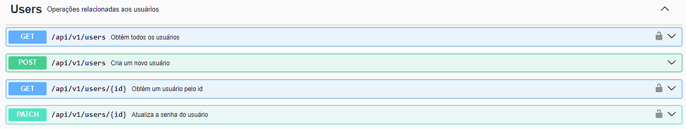
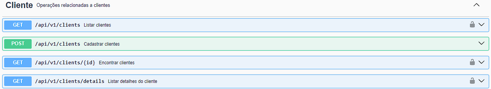
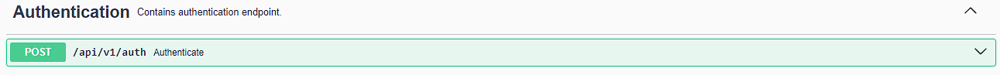
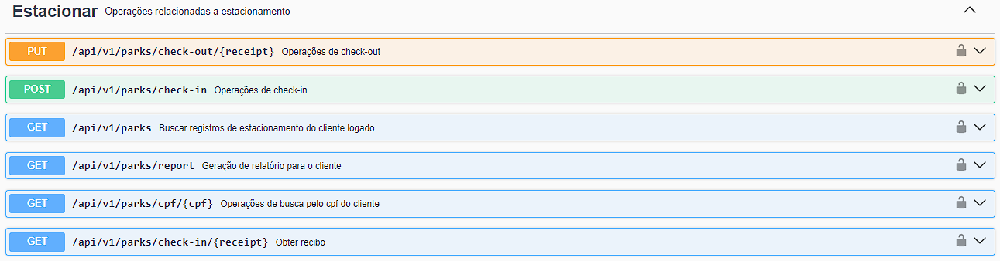
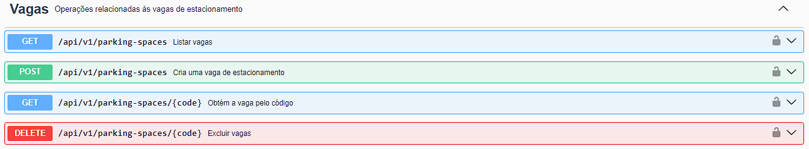
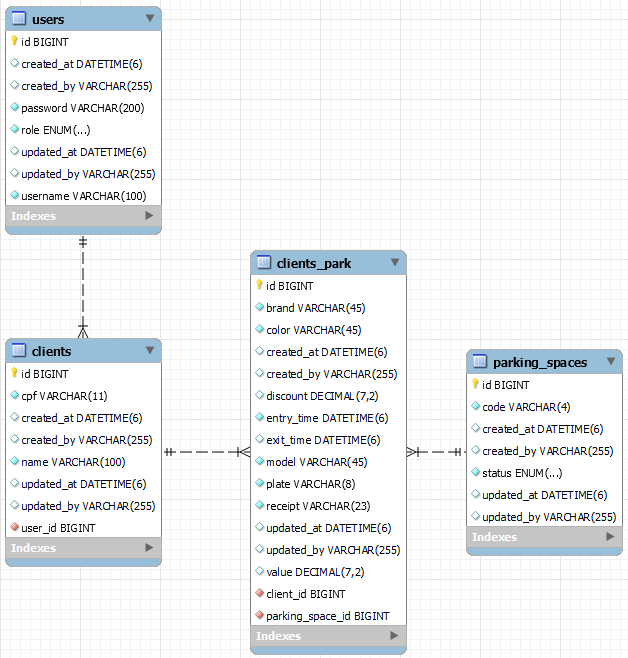

# API de Gerenciamento de Estacionamento

Esta é uma API para gerenciamento de estacionamento, que permite gerenciar usuários, vagas, check-ins e check-outs, além de gerar relatórios do histórico do cliente.

## Tecnologias Utilizadas

- **Java 17**
- **Spring Boot 3.3.2**
- **Spring Data JPA**
- **Spring Web**
- **Spring Security**
- **Spring Validation**
- **Springdoc OpenAPI**
- **MySQL Connector**
- **Lombok**
- **JJWT (Java JWT)**
- **JasperReports**
- **Maven**

## Configuração do Ambiente

### Pré-requisitos

- **Java 17**: Certifique-se de que o Java 17 está instalado em sua máquina.
- **Maven**: Para o gerenciamento de dependências.
- **Banco de Dados**: MySQL.

### Configuração do Banco de Dados

Crie um banco de dados e configure as credenciais no arquivo `application.properties`

### Documentação

> [!NOTE]
> Para visualizar a documentação completa é necessário executar a aplicação e acessar o link abaixo
> 
- [Detalhes da documentação](http://localhost:8080/swagger-ui/index.html#/)

### Modelo do Relatório

### Lógica dos Preços

- **Até 15 minutos:** R$ 5,00
- **Até 60 minutos:** R$ 9,25
- **Para cada 15 minutos adicionais:** R$ 1,75

**Descontos:**

- Clientes que realizam a 10ª visita recebem um desconto de 30% no valor total.

**Geração de Recibo:**

- Ao realizar um check-in, o número do recibo é gerado automaticamente no formato:
  `PLACA-YYYYMMDD-HHMMSS`
- Exemplo: `ABC1234-20240806-135407`

### Diagrama do banco de dados

