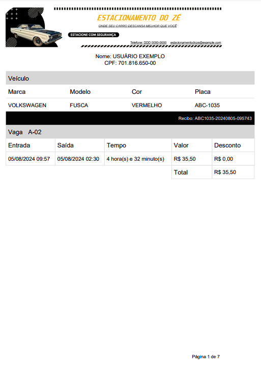

# API de Gerenciamento de Estacionamento

Esta é uma API para gerenciamento de estacionamento, que permite gerenciar clientes, funcionários, vagas, check-ins e check-outs, além de gerar relatórios do histórico do cliente.

## Tecnologias Utilizadas

- **Java 17**
- **Spring Boot 3.3.2**
- **Spring Data JPA**
- **Spring Web**
- **Spring Security**
- **Spring Validation**
- **Springdoc OpenAPI**
- **MySQL Connector**
- **Lombok**
- **JJWT (Java JWT)**
- **JasperReports**
- **Maven**

## Configuração do Ambiente

### Pré-requisitos

- **Java 17**: Certifique-se de que o Java 17 está instalado em sua máquina.
- **Maven**: Para o gerenciamento de dependências.
- **Banco de Dados**: MySQL.

### Configuração do Banco de Dados

Crie um banco de dados e configure as credenciais no arquivo `application.properties`

### Documentação

- **Toda a documentação pode ser obtida neste link**: [Documentação da API](http://localhost:8080/swagger-ui/index.html#/)

### Modelo do Relatório

# Getting Started

### Reference Documentation
For further reference, please consider the following sections:

* [Official Apache Maven documentation](https://maven.apache.org/guides/index.html)
* [Spring Boot Maven Plugin Reference Guide](https://docs.spring.io/spring-boot/docs/3.3.2/maven-plugin/reference/html/)
* [Create an OCI image](https://docs.spring.io/spring-boot/docs/3.3.2/maven-plugin/reference/html/#build-image)
* [Spring Boot DevTools](https://docs.spring.io/spring-boot/docs/3.3.2/reference/htmlsingle/index.html#using.devtools)
* [Spring Web](https://docs.spring.io/spring-boot/docs/3.3.2/reference/htmlsingle/index.html#web)
* [Spring Data JPA](https://docs.spring.io/spring-boot/docs/3.3.2/reference/htmlsingle/index.html#data.sql.jpa-and-spring-data)

### Guides
The following guides illustrate how to use some features concretely:

* [Building a RESTful Web Service](https://spring.io/guides/gs/rest-service/)
* [Serving Web Content with Spring MVC](https://spring.io/guides/gs/serving-web-content/)
* [Building REST services with Spring](https://spring.io/guides/tutorials/rest/)
* [Accessing Data with JPA](https://spring.io/guides/gs/accessing-data-jpa/)
* [Accessing data with MySQL](https://spring.io/guides/gs/accessing-data-mysql/)

### Maven Parent overrides

Due to Maven's design, elements are inherited from the parent POM to the project POM.
While most of the inheritance is fine, it also inherits unwanted elements like `<license>` and `<developers>` from the parent.
To prevent this, the project POM contains empty overrides for these elements.
If you manually switch to a different parent and actually want the inheritance, you need to remove those overrides.

